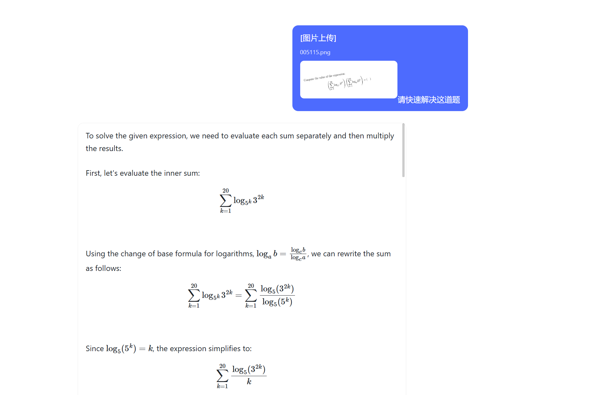
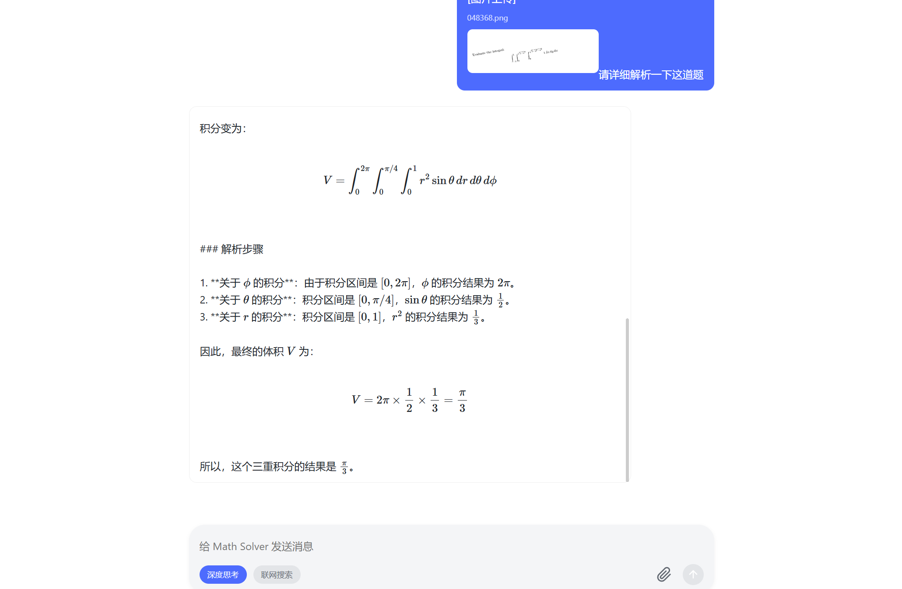

### Nano‑Math‑plus Upgrade

- 1 To address the original Nano‑Math model’s inability to produce very long chains of thought for math problems, I performed GRPO post‑training on top of the Nano‑Math SFT model so it can output extremely long reasoning chains. At the same time, I preserved the model’s fast‑solving ability, i.e.:
  - Users can upload an image that contains a math problem without clicking any extra buttons. The model outputs the final answer in short form (capped at 1024 tokens), as shown below:
  - 
  - If users need a more detailed explanation or more complex calculations, click “Deep Thinking” and the model will generate a detailed reasoning (no explicit maximum on output length), as shown below:
  - 
- 2 The project adopts streaming output, so answers appear in real time without waiting for completion.
- 3 Nano‑Math‑plus supports a “web‑enabled search” feature to extend the model’s prior knowledge, improving problem‑solving ability and also enabling general queries (e.g., “What is today’s weather in Beijing?”).

### Project Structure and Responsibilities
- Top‑level Overview
  - WebUI: Web frontend and backend for image upload, model inference, streaming output, and web search
  - tensorboard_export: CSV metrics exported from TensorBoard during training and an automatic plotting script
  - data_process: Data processing scripts (sampling, conversion, repair, etc.)
  - dataset‑verl: Train/validation/test datasets (json, parquet)
  - config: Training‑related configurations
  - src: Training entry scripts
  - merged_safetensors / merged_hf / best_checkpoint / pretrained_model: Model weights and checkpoints
  - verl: Reinforcement learning training framework and docs (integrated from VERL)
  - figure: Illustrations

- Key Directories and Files
  - WebUI
    - [app.py](WebUI/app.py): Flask backend
      - Loads the Qwen2.5‑VL inference model; accepts image/text input
      - Two modes: normal vs. deep thinking (dynamic max_new_tokens)
      - Streaming inference output (TextIteratorStreamer)
      - Web search (DuckDuckGo/Bing fallback) and direct weather query (Open‑Meteo)
    - [templates/index.html](WebUI/templates/index.html): Frontend page
      - Image upload, parameter toggles (deep thinking / web‑enabled search), streaming message rendering, and auto‑scroll
    - WebUI/icons
      - Static assets such as generate_logo.html
  - tensorboard_export
    - CSV metrics (e.g., .__actor__entropy.csv, .__perf__throughput.csv, etc.)
    - [plot_tensorboard_csvs.py](tensorboard_export/plot_tensorboard_csvs.py): Batch‑read CSVs and generate paginated multi‑subplot mosaics (plots_page_*.png)
    - plots_page_*.png: Auto‑generated overview images (24 subplots per page)
  - data_process
    - [10p_samples.py](data_process/10p_samples.py): Sampling
    - [data_transfer.py](data_process/data_transfer.py): Data migration/copying
    - [json2parquet.py](data_process/json2parquet.py): JSON → Parquet
    - [repair_dataset.py](data_process/repair_dataset.py): Data repair and cleaning
  - dataset‑verl
    - train/valid/test: Datasets with data.json and data.parquet
  - config
    - [train_config.yaml](config/train_config.yaml): GRPO and related training configs
  - src
    - [run_grpo.sh](src/run_grpo.sh): Entry point for GRPO training
  - Model‑related
    - best_checkpoint/[...]/: Intermediate/best checkpoints (e.g., global_step_650/data.pt)
    - merged_hf/[...]/: Merged HuggingFace‑format model (including tokenizer, config, chat_template, etc.)
    - merged_safetensors/[...]/: Final weights and configs for deployment (consumed by WebUI)
    - pretrained_model/[...]/: Base SFT model and tokenizer configs
  - verl (training framework and docs)
    - docs/: Guides for GRPO/OP(O)/SPPO, FSDP, Ray, vLLM, etc.
    - examples/: Various training/inference examples (e.g., grpo_trainer/*)
    - verl/: Core code (trainer, workers, utils, single_controller, etc.)
    - docker/, .github/: Build and CI configs

- Typical Workflow
  - Data preparation: data_process → dataset‑verl/{train, valid, test}
  - Training and export: src/run_grpo.sh + config/train_config.yaml → best_checkpoint → merged_hf/merged_safetensors
  - Visualization: Sync to TensorBoard → Export to tensorboard_export/*.csv → Run plot_tensorboard_csvs.py to generate mosaics
  - Online inference: WebUI loads merged_safetensors model; supports image‑based solving, deep thinking, and web‑enabled search (with direct weather queries)

### Environment Setup
Using the VERL framework for GRPO post‑training introduces many dependencies and environment variables, which can easily conflict. Below is a reference environment that has been tested to start training successfully (CUDA 12.4 recommended):

```bash
# Create and activate environment
conda create -n verl python=3.10 -y
conda activate verl

# Base dependencies
pip install vllm==0.8.2
pip install tensordict==0.6.2
# Optional: if you need sglang
# pip install sglang==0.4.5.post3
pip install torch==2.6.0 torchaudio==2.6.0 torchvision==0.21.0
pip install ray==2.44.0
```

Download a FlashAttention prebuilt wheel that matches your environment (example v2.6.3), then install it locally (you can use the file already in the project root if present):

```
https://github.com/Dao-AILab/flash-attention/releases/tag/v2.6.3
```

```bash
pip install xxx.whl
```

Install VERL (pinned to 0.5.0 recommended):

```bash
git clone https://github.com/volcengine/verl
cd verl
git checkout v0.5.0
pip install -e .
```

Note: Install VERL v0.5.0 from GitHub first, then apply modifications from this project (e.g., reward function and other source changes).

### GRPO for LCoT on Math Problems: Custom Reward Function
This project adds a custom reward manager designed for long‑chain math reasoning on top of VERL’s reward system. Two extension paths are provided: replace only the “scoring function” or add a new “reward manager”.

- Functional Overview (built into this repo)
  - Location: `verl/verl/workers/reward_manager/my_reward_manager.py`
  - Goal: Encourage correct and well‑formatted LCoT while suppressing meaningless verbosity
  - Scoring components (weighted sum, clipped to [-1.5, 2.5]):
    - Correctness: Equivalence via `prime_math.grader.math_equal`, with fallback to exact match
    - Format: Prefer extracting the final answer in `\boxed{...}`, fallback to GSM8K extractor if needed
    - Reasoning quality: Heuristic signals from logical markers, math terminology, paragraph structure, etc.
    - Length preference: No reward below `min_cot_length`; linear gain on `[min_cot_length, max_cot_length]`; decay beyond the upper bound
  - Shape and writeback: The final “score” is written only at the last token position of each response (token‑level reward)
  - Debug prints: `num_examine` controls example prints

- Interface (built into this repo)
  - Class registry name: `my_reward_manager` (via `@register("my_reward_manager")`)
  - Constructor: `__init__(tokenizer, num_examine, compute_score=None, reward_fn_key="data_source")`
  - Call signature: `__call__(data: DataProto, return_dict=False)`
    - Input: `DataProto`
      - Text tensors: `batch["prompts"]`, `batch["responses"]`, `batch["attention_mask"]`
      - Labels: `non_tensor_batch["reward_model"]["ground_truth"]` or fallback `non_tensor_batch["extra_info"]["answer"]`
    - Output:
      - `return_dict=False` → `Tensor` (same length as responses; non‑last tokens are zeros)
      - `return_dict=True` → `{"reward_tensor": Tensor, "reward_extra_info": Dict[str, List[float]]}`

- After editing `my_reward_manager.py`, register it in `verl/verl/workers/reward_manager/__init__.py` by adding:

```python
from .my_reward_manager import MyRewardManager
```

This is required to use the custom reward manager.

### Visual Input Preprocessing for VLM
First check whether the number of visual tokens (after converting the input image) exceeds 2k. If so, proportionally downscale the image to reduce resolution until the visual tokens are within 2k. This reduces memory usage during training and avoids OOM due to excessive visual tokens.

### Training Configuration
I trained on AutoDL with 2× H800 (80GB) GPUs. Due to time constraints, I set the maximum steps to 700 and the validation set to 200 samples. The total training time was about 12–14 hours.
Please refer to `config/train_config.yaml` for details.

### Merge and Export to merged_safetensors
This project uses VERL’s built‑in model_merger to merge FSDP training artifacts into HuggingFace‑format safetensors shards, and then copies them to `merged_safetensors` for WebUI loading. Below are the commands used at the time (relative paths):

```bash
python -m verl.model_merger merge \
  --backend fsdp \
  --local_dir best_checkpoint/global_step_650/actor \
  --target_dir merged_hf/global_step_650
```

```bash
mkdir -p merged_safetensors
cp -r merged_hf/global_step_650 merged_safetensors/
```

### Training Logs
Training logs are saved under the tensorboard_export directory. I use the plotting tool to visualize all outputs as training curves, for example:


### Questions and Issues
If you run into any problems, please open an issue.

### Contact
Email: 18722164190@163.com

### Star
If you find this project helpful, please consider giving it a Star ⭐!
